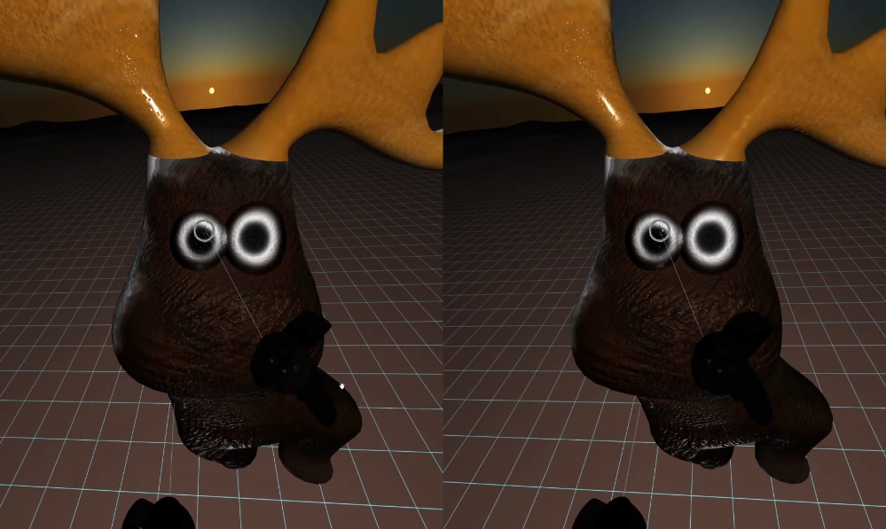

# VARTISTE

VARTISTE is a 2D / Surface drawing and painting app for virtual reality.

- [Launch VARTISTE](https://zach-geek.gitlab.io/vartiste/index.html)
- [Instructions](https://zach-geek.gitlab.io/vartiste/landing.html)
- [Source Code](https://gitlab.com/zach-geek/vartiste)
