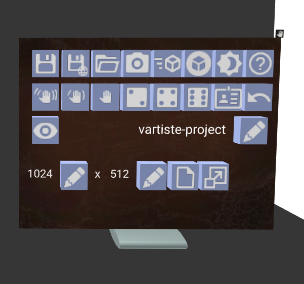

# Interface Overview

The VARTISTE interface is mainly divided into 3 sections:

  1. The canvas and model (straight ahead by default)
  2. The settings and controls on the left
  3. The layers and nodes on the right

The main UI components are:

  - Shelves, which mainly contain a lot of buttons
  - Buttons
  - Edit Fields
  - Canvases

UI components can be clicked by pointing at them and using the primary trigger
or mouse button. Most components can also be grabbed and moved using the
controller's grab control (e.g., the grab trigger on Rift Touch controllers, or
squeezing the grip on the Valve Index).

# Drawing Tutorials

## 

# Interface Reference

## Settings Shelf

The settings shelf contains buttons for:

- Saving, Loading, Importing, and Exporting
- Misc Settings

## Toolbox Shelf

The toolbox shelf contains experimental features that could break or be removed
at any time.

## 6-degrees-of-freedom Tools

The 6 degree-of-freedom tools are tools that are intended to be grabbed and
moved around

# Drawing Reference

## Layers

## Node System

## Animation

## 3D Loading

## References

## Skeletonator
