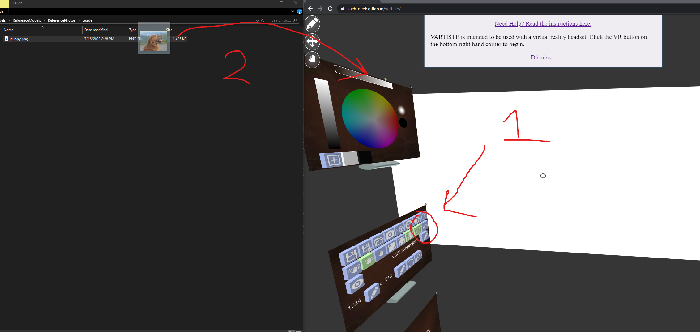
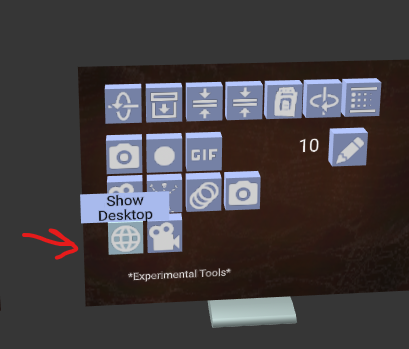
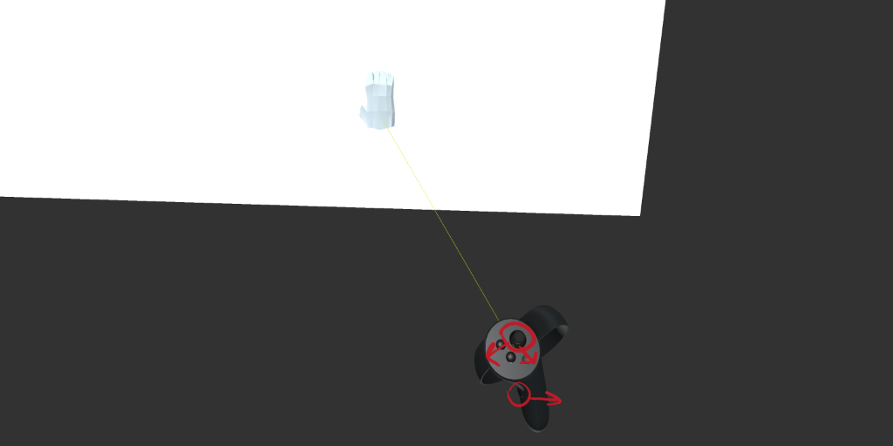
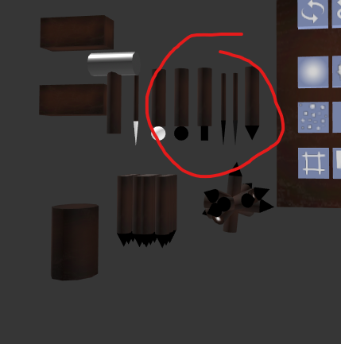
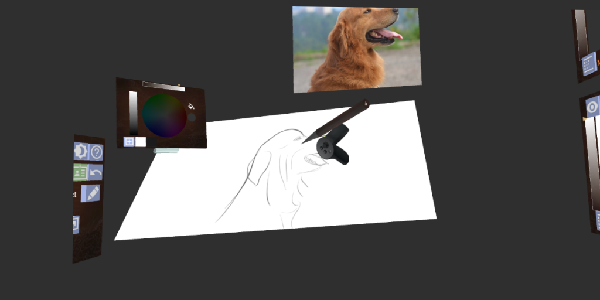
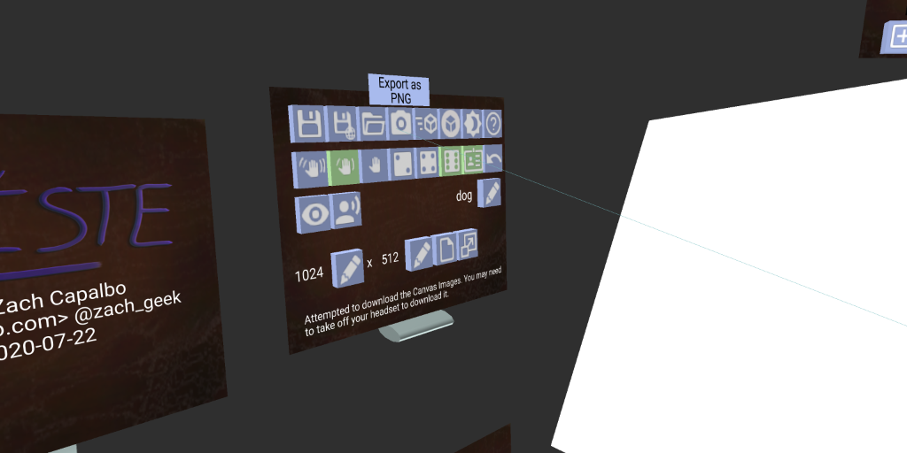
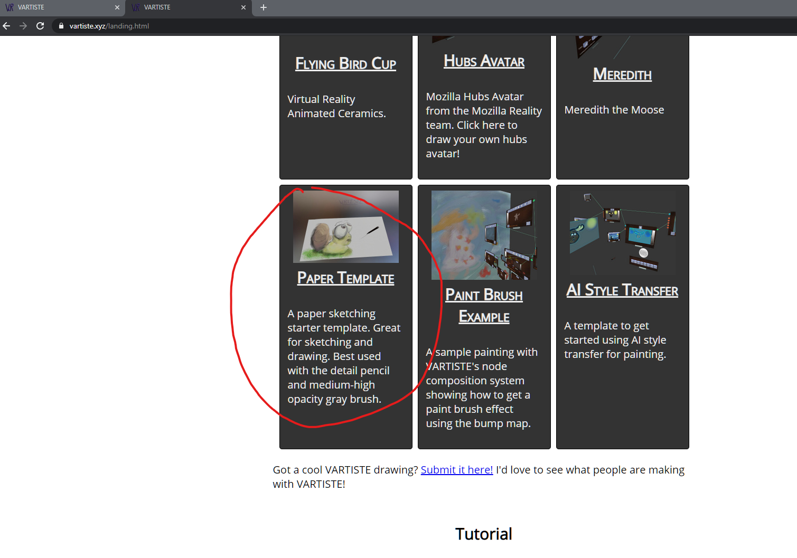

<a class="vartiste-url" href="https://vartiste.xyz">https://vartiste.xyz</a>

# Interface Overview

The VARTISTE interface is mainly divided into 3 sections:

  1. The canvas and model (straight ahead by default)
  2. The settings and controls on the left
  3. The layers and nodes on the right

The main UI components are:

  - Shelves, which mainly contain a lot of buttons
  - Buttons
  - Edit Fields
  - Canvases

UI components can be clicked by pointing at them and using the primary trigger
or mouse button. Most components can also be grabbed and moved using the
controller's grab control (e.g., the grab trigger on Rift Touch controllers, or
squeezing the grip on the Valve Index).

# Drawing Tutorials

## Sketching Practice

Sketching with VARTISTE can be pretty fun and roughly approximate sketching with
pencil and paper. This tutorial will go over importing reference photos,
arranging your workspace, and drawing with the 6-DOF detail pencil.

### Import your reference photo(s)

It's always helpful to have references to sketch from. I'm going to use [this
picture of a dog (Photo by Garfield Besa from
Pexels)](https://www.pexels.com/photo/shallow-focus-photography-of-a-golden-retriever-686094/),
but you can use whatever images you want.

The first step is to turn on the Refernce Toggle  button on the settings
shelf. Then simply drag and drop your image onto the VARTISTE browser window. I
find it easier to do this step before entering VR, personally.

Next enter VR and put on your headset. *Note:* Before you do, you'll probably
want some way to keep following along with this guide. If your headset has a
virtual desktop setting (e.g., Oculus Dash), you can use that, or you can use
the experimental Share Desktop button to share the browser window into your
desktop.

Once in VR, you can grab the canvas and bring it closer to you. Grab it using by
pointing at it, then hold your controller's Grab trigger or buttons, and then
press down on the joystick or trackpad. This should bring the canvas closer to
you. While bringing it in, you might want to also hold left on the joystick or
trackpad to make it smaller. You can adjust the reference photo in the same way,
too.

Next, look over your left shoulder. You should see a bunch of pencils and other
grabbable tools. Point at one of them, and do the same grab and bring closer
action as before. Grab it with a comfortable grip, and bring it to the canvas to
start drawing! I'm going to use the detail pencil brush.

You can adjust the overall scale of the pencil by pointing at the canvas and
pressing up or down on the joystick / trackpad, or using the up and down arrows
on the brush shelf.

Now get comfortable and start sketching. I like to lower the opacity a bit to
start. Just grab the pencil, and apply the tip to the canvas. The more you press
into it, the heavier / more opaque the stroke will be.

At any point, you can press the Save  button
to download a `.vartiste` project file, or the Save to Browser  to save the VARTISTE project right
into your browsers local storage. Saving with either method will allow you to
open the project again and continue where you left off. Simple drag and drop the
`.vartiste` onto the browser window, or use the Open  button to load a project from browser storage.

Once you're done drawing, you can download the canvas as a PNG, using the Export as PNG  button. Note that this saves a single image, and doesn't preserve your layers or reference images. For that you should save a `.vartiste` project file.

Extra tip: If you start from the [Paper
Template](/index.html?load=gallery/paper.vartiste), you can follow these same
instructions and it'll feel even more like sketching on "real" paper. You can access the templates from the Gallery secion of the [Instructions Page](/landing.html)

There are a lot of other ways to draw with VARTISTE, and a ton more features to
explore, but this should be enough to get you started!

## Use VARTISTE to paint on [Gravity Sketch](https://www.gravitysketch.com/) models

COMING SOON! Follow [@zach_geek](https://twitter.com/zach_geek) on Twitter to
get updates.

<!--
# Interface Reference

## Settings Shelf

The settings shelf contains buttons for:

- Saving, Loading, Importing, and Exporting
- Misc Settings

## Toolbox Shelf

The toolbox shelf contains experimental features that could break or be removed
at any time.

## 6-degrees-of-freedom Tools

The 6 degree-of-freedom tools are tools that are intended to be grabbed and
moved around

# Drawing Reference

## Layers

## Node System

## Animation

## 3D Loading

## References

## Skeletonator
-->
