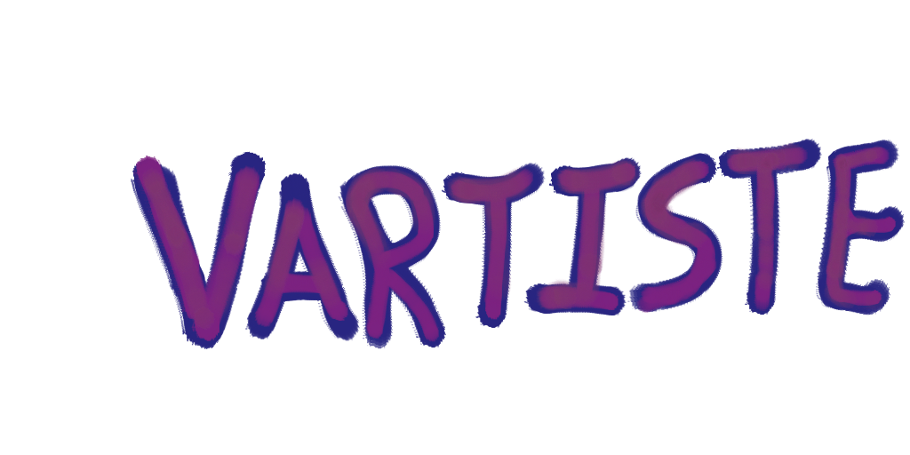
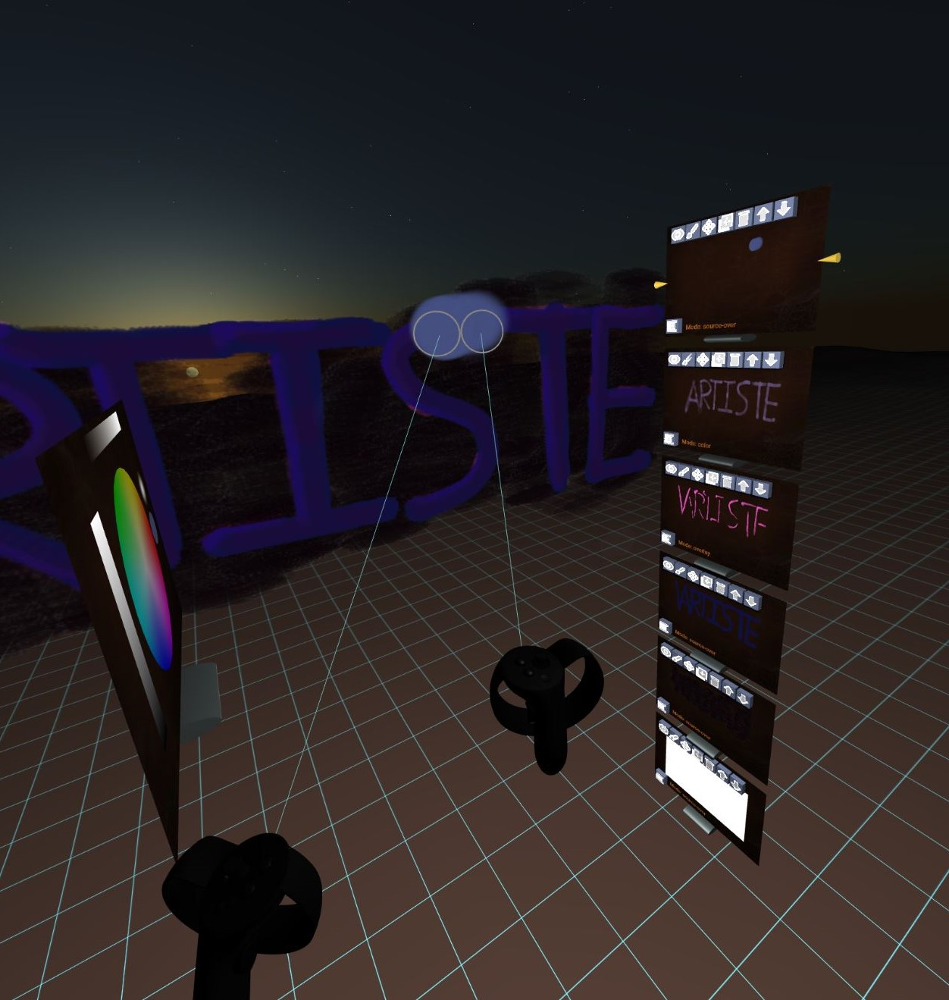
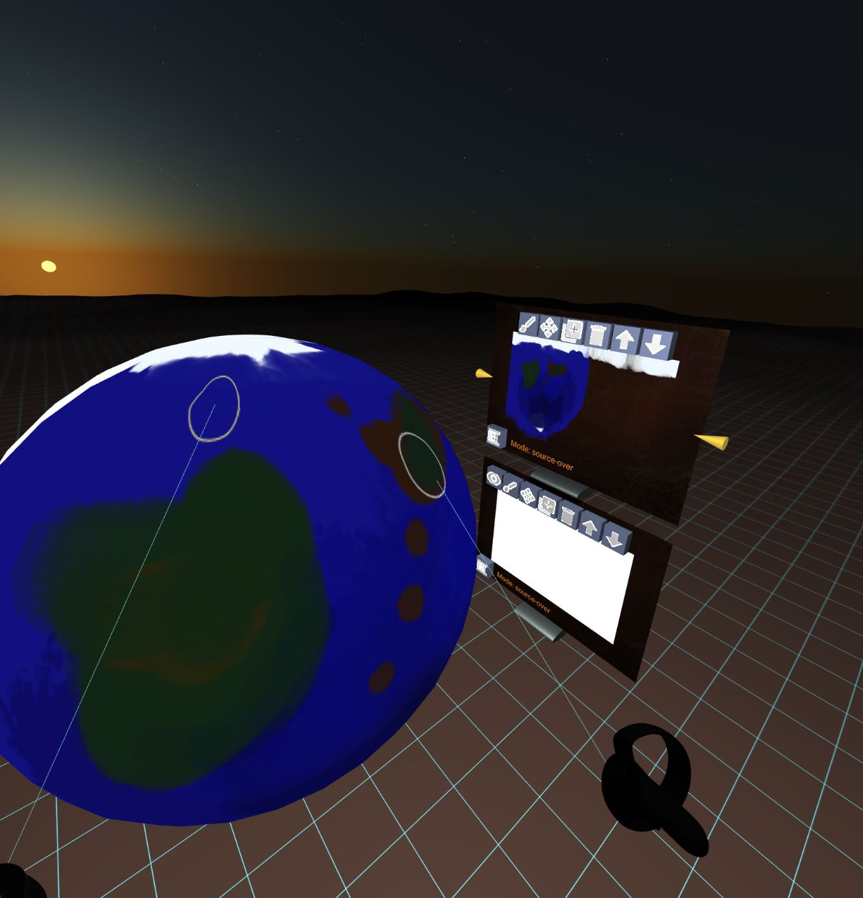

# VARTISTE

<a class="vartiste-url" href="https://vartiste.xyz">https://vartiste.xyz</a>

Pronounced Vee-Ar-tEEst. VARTISTE is a virtual reality app for 2D drawing and
image editing. A virtual reality headset with tracked motion controllers, such
as the [Valve Index](https://store.steampowered.com/valveindex) or
[Oculus Rift S](https://www.oculus.com/rift-s/) is required to use it.

<a class="launch-button" href="index.html">LAUNCH VARTISTE</a>

VARTISTE works similar to desktop image editing software you may be used to; it
has layers, brushes, color wheels and palettes. However, it's specially designed
for VR headset use, so it will respond to controller pressure and position, and
you can move your canvas around to get the perfect vantage point for editing.
No more being tethered to a monitor or drawing tablet! It's even got a really
cool node & FX compositing system available. Become a VR-Artíste today!

VARTISTE also takes advantage of being a VR image editor, by allowing you to
draw textures right onto your model! You can still use all of the features like
layers and brushes, and you can even draw onto the material properties like
roughness and bump map!

## Gallery

Click on any of the entries below to load them into VARTISTE.

Got a cool VARTISTE drawing? [Submit it here!](https://gitlab.com/zach-geek/vartiste/-/issues/new?issue%5Btitle%5D=New%20Gallery%20Submission&issue%5Bdescription%5D=Please%20add%20a%20preview%20and%20a%20link) I'd love to see what people are making with VARTISTE!

## Tutorial

There is a playlist of VARTISTE [tutorials on Youtube](https://www.youtube.com/playlist?list=PLZewqT0OiTDR1k3xGuIe-dqZsmkshO8G0)

<iframe width="560" height="315" src="https://www.youtube.com/embed/videoseries?list=PLZewqT0OiTDR1k3xGuIe-dqZsmkshO8G0" frameborder="0" allow="accelerometer; autoplay; encrypted-media; gyroscope; picture-in-picture" allowfullscreen></iframe>

There's also a list of VARTISTE feature demos:

<a class="twitter-timeline" data-width="600" data-height="800" data-dnt="true" href="https://twitter.com/zach_geek/timelines/1254792745551572995?ref_src=twsrc%5Etfw">VARISTE Demos - Curated tweets by zach_geek</a>

## Controls
For Oculus Touch controllers:

 - Right Hand:
  - Trigger: Draw, Click buttons
  - Grip: Grab and move
  - A: Erase
  - B: Pick color from canvas
  - Joystick Right/Left: Turn camera right/Left
  - Joystick Up/Down: Make brush bigger/smaller
 - Right Hand (While Grabbing)
  - Joystick Right/Left: Make grabbed object bigger / smaller
  - Joystick Up/Down: Push / pull grabbed object
  - Joystick Press: Toggle Orbit Mode
  - A: Toggle Rotation Lock
 - Right Hand (While Grabbing during Orbit Mode)
  - Joystick Right/Left: Rotate grabbed object on Z axis
  - Joystick Up/Down: Rotate grabbed object on Y axis

 - Left Hand:
  - Trigger: Draw
  - X Button: Undo
  - Press Joystick: Reset camera
  - Joystick Right/Left: Next/Previous frame
  - Joystick Up: Add blank frame
  - Joystick Down: Duplicate current frame

For Vive Wands (and currently Valve Index controllers, although that should change soon):

- Right Hand:
 - Trigger: Draw, Click buttons
 - Grip: Grab and move
 - Press trackpad: Erase
 - Trackpad Right/Left: Turn camera right/Left
 - Trackpad Up/Down: Make brush bigger/smaller
- Right Hand (While Grabbing)
 - Trackpad Right/Left: Make grabbed object bigger / smaller
 - Trackpad Up/Down: Push / pull grabbed object
 - Press Trackpad: Toggle Rotation Lock

- Left Hand:
 - Trigger: Draw
 - Menu: Reset camera
 - Press trackpad: Pick color from canvas
 - Trackpad Right/Left: Next/Previous frame
 - Trackpad Up: Add blank frame
 - Trackpad Down: Duplicate current frame

For Desktop Use: (Not the primary intended use, but it should still work)

- Left Mouse Button: Draw
- Middle / Right Mouse Button (Drag): Rotate Camera
- Shift + Left Mouse Button (Drag): Grab and move objects
- Middle Mouse Button: Draw
- W: Move Forward
- S: Move Backward
- A: Move Left
- D: Move Right
- Q: Move Up
- E: Move Down

## Saving and loading

To download your project as a VARTISTE project file, click the "File"
 icon on the settings shelf. You might need to take
your headset off to click the "download" button on your browser. You can also
save the file to your browser's memory by clicking the "Save to Browser"  icon. **Please Note:** clearing
certain browser history data may remove VARTISTE projects from browser memory.

To load a VARTISTE file, drag and drop it onto the browser window where VARTISTE
is running. **NOTE: This will replace your currently active scene.** You can
also use the "Load"  icon to load
projects from browser memory or browse using a file selector.

To save a PNG, click the "Camera"  icon. You'll
need to take off your VR headset and click the download button from your
browser.

To import an image as a new layer, drag and drop it onto the browser window.

To import a 3D model, drag and drop it onto the browser window. The model should
appear in front, and the 2D canvas view will flip to behind you.
**Note the following:**
 - Only `.glb` format is supported (GLTF binary)
 - The UVs must be already present in the glb file
 - Draco compression is not currently supported
 - Existing textures will be resized to the main canvas size
 - Vertex colors are not currently imported

To export a 3D model, use the "Export" 
icon. This will download a GLB file with the currently displayed model or
canvas. You can also export directly to [Sketchfab](https://sketchfab.com) using
the "Sketchfab"  icon. The first time
you click this icon, you'll be prompted to log into Sketchfab and authorize
VARTISTE, so make sure you save before you do this.

**NOTE:** Canvas Animations are not currently imported or exported to GLB files.
They are, however, saved into the project file.

## Node Compositing System

By default, VARTISTE operates in Layer mode, where layers can be ordered one on
top of the other, similar in operation to the GIMP or Photoshop. VARTISTE also
has another mode of operation, called Node mode. VARTISTE can be toggled between
Layer and Node mode by pressing the "Toggle"  button on the Layer / Node control panel.

Node mode works in a roughly similar way to the Blender compositing nodes, for
instance. Outputs from Layers and nodes are connected to Node inputs, allowing
dynamically updating effects.

## Animation System

The animation system is controlled by the Animation shelf. Layers can each have
multiple frames. The animation shelf will show the number of frames for the
active layer, and allow adding, deleting, and duplicating active layer frames.

There is a single timeline and framerate for all frames, and layers will repeat
however many frames they have over and over again. Any drawing will be applied
to the current frame, which can change over the course of the drawing. This
means if the animation is currently playing back, then parts of strokes can be
applied to different frames, giving a kind of animated brush effect.

## Tips And Tricks

- **Tip:** If VARTISTE is slow, unresponsive, or laggy
  - Use the Medium Quality  or Low Quality 
  - Use a smaller canvas size
  - Break up large models into smaller chunks, or use lower-resolution verions.
    As long as everything shares the same UV map, you can import the large model
    at the end to combine it all.
  - Turn off Hand Stabilization 
  - I've gotten the best performance out of [Chrome Canary](https://www.google.com/chrome/canary/)
- **Trick:** To _Copy and Paste_ try this:
  1. Duplicate  the layer
  1. Erase the parts of the duplicated layer that you don't want copied
  1. Use the Grab Layer  button and then
     grab and move the layer where you want it to go
  1. Use the Stamp Down 
     button to stamp the layer onto the layer below
  1. Grab and stamp again as many times as desired
- **Tip:** If you're working with a really smooth or metallic model, try adding
  an Environment Map (`envMap`) layer
  - You can find images to use for environment maps at [WikiMedia Commons 360° Panoramas](https://commons.wikimedia.org/w/index.php?title=Category:360°_panoramas#mw-category-media)
  - Environment map layers don't need to be the same size as the rest of the
    layers, so you can use higher or lower quality images if helpful.
  - Environment maps only take effect if 3D Shading 
    is enabled
- **Trick:** Some brushes, like the default smooth circle brush, will draw
  connected lines as you move your hand around. If you're drawing onto a 3D
  model, and the UV map is discontinuous, this can cause a big line to go
  through to all sorts of areas where you don't expect. Some ways to deal with
  that:
  - Use a brush that doesn't connect lines (most of the textured brushes)
  - Use a different method for unwrapping your model UV map

## Issues

This is a very early version of the software. It still needs a lot of love. If
you encounter problems, you can [Submit an Issue Report](https://gitlab.com/zach-geek/vartiste/issues).
If you feel inclined, you can also [Contribute code in the form of a Merge Request](https://gitlab.com/zach-geek/vartiste).

## Open Source

VARTISTE is an open source project under the Apache 2.0 license. You can find
the source code here: <https://gitlab.com/zach-geek/vartiste>

## Privacy Policy

VARTISTE is a client-side-only application. No information about you whatsoever
is collected by VARTISTE. Any information you enter into the program stays on
your browser.

VARTISTE is hosted by [Gitlab Pages](https://about.gitlab.com/product/pages/).
The Gitlab Pages server may collect  standard information under the [Gitlab
Privacy Policy](https://about.gitlab.com/privacy/)

This landing page employs Twitter and Youtube embedded videos. These services
have their own privacy policies.

## About

This is a spare-time project developed by [Zach Capalbo](https://zachcapalbo.com).
It's released publicly in the hopes that it will be useful, but it comes with
absolutely no guarantee of support or working correctly.
