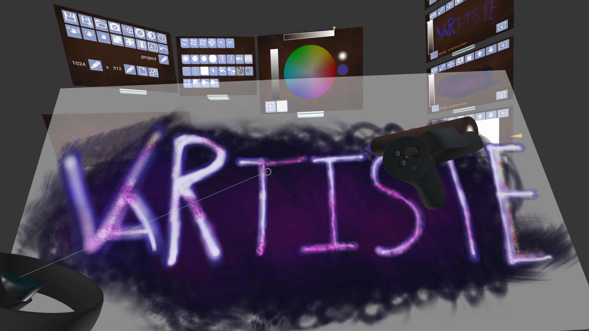
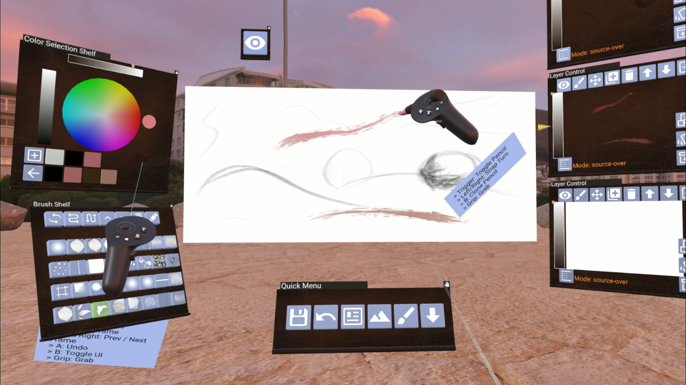
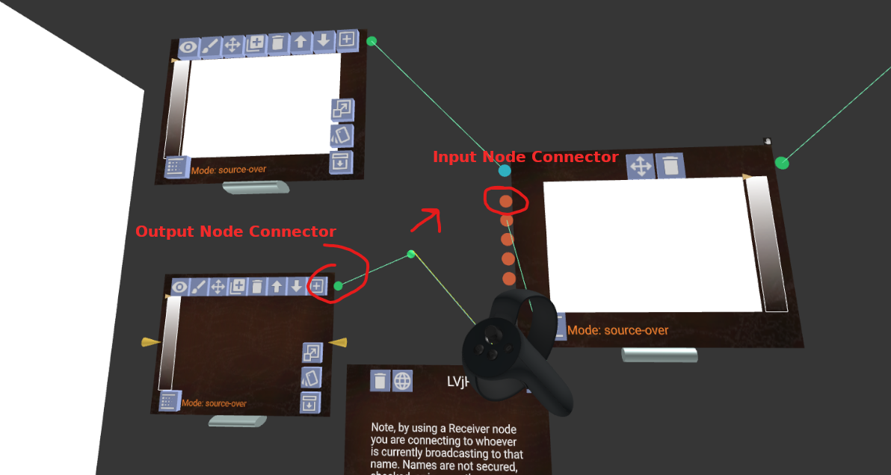
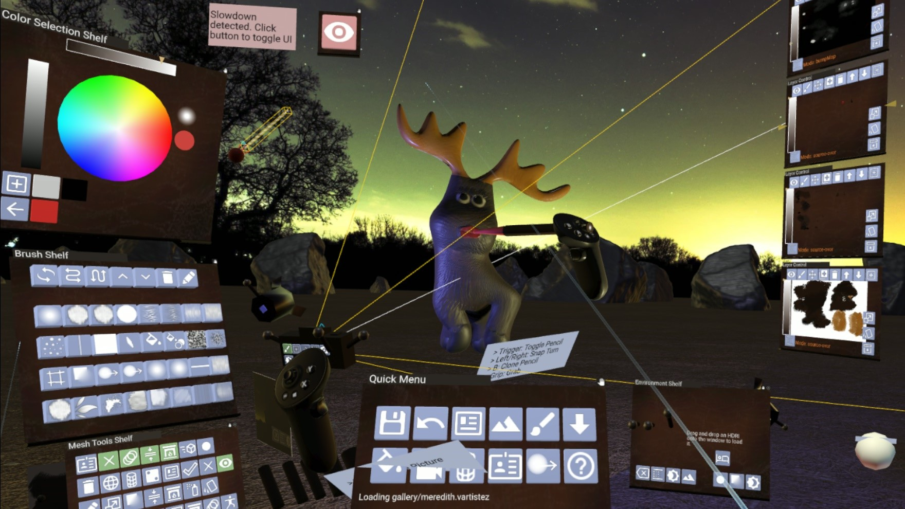

# VARTISTE

<a class="vartiste-url" href="https://vartiste.xyz">https://vartiste.xyz</a>

Pronounced Vee-Ar-tEEst. VARTISTE is a virtual reality app for 2D drawing and
image editing, and 3D model texturing. A virtual reality headset with tracked
motion controllers, such as the [Valve
Index](https://store.steampowered.com/valveindex) or [HP Reverb G2](https://www8.hp.com/us/en/vr/reverb-g2-vr-headset.html) is required to use it.

<a class="launch-button" href="index.html">LAUNCH VARTISTE</a>

<small><a href="#download">Or Download below...</a></small>

VARTISTE works similar to desktop image editing software you may be used to; it
has layers, brushes, color wheels and palettes. However, it's specially designed
for VR headset use, so it will respond to controller pressure and position, and
you can move your canvas around to get the perfect vantage point for editing.
No more being tethered to a monitor or drawing tablet! It's even got a really
cool node & FX compositing system available. Become a VR-Artíste today!

VARTISTE also takes advantage of being a VR image editor, by allowing you to
draw textures right onto your model! You can still use all of the features like
layers and brushes, and you can even draw onto the material properties like
roughness and bump map!

## Gallery

Click on any of the entries below to load them into VARTISTE.

Got a cool VARTISTE drawing? [Submit it here!](https://discord.gg/DZnQBE2grJ) I'd love to see what people are making with VARTISTE!

## Tutorials

There is a playlist of VARTISTE [tutorials on Youtube](https://www.youtube.com/playlist?list=PLZewqT0OiTDR1k3xGuIe-dqZsmkshO8G0)

<iframe width="560" height="315" src="https://www.youtube.com/embed/videoseries?list=PLZewqT0OiTDR1k3xGuIe-dqZsmkshO8G0" frameborder="0" allow="accelerometer; autoplay; encrypted-media; gyroscope; picture-in-picture" allowfullscreen></iframe>

## Features

Some of the best documentation so far comes from the short demo videos I posted to [Twitter](https://twitter.com/zach_geek) during development. Some of the videos may display an outdated UI, and the locations for some features may have changed.

Expand these feature categories to explore the many many VARTISTE features:

## Controls
For Reverb G2 / Valve Index / Oculus Touch type controllers:

 - Right Hand:
  - Trigger: Draw, Click buttons
  - Grip: Grab and move
  - A: Erase
  - B: Pick color from canvas
  - Joystick Right/Left: Turn camera right/Left
  - Joystick Up/Down: Make brush bigger/smaller
 - Right Hand (While Grabbing)
  - Joystick Right/Left: Make grabbed object bigger / smaller
  - Joystick Up/Down: Push / pull grabbed object
  - Joystick Press: Toggle Orbit Mode
  - A: Toggle Rotation Lock
  - B: Clone pencil tool

 - Left Hand:
  - Trigger: Draw
  - X Button: Undo
  - Y Button: Speech Recognition (If supported by browser). Otherwise, Toggle UI
  - Press Joystick: Reset camera
  - Joystick Right/Left: Next/Previous frame
  - Joystick Up: Add blank frame
  - Joystick Down: Duplicate current frame

For Vive Wands:

- Right Hand:
 - Trigger: Draw, Click buttons
 - Grip: Grab and move
 - Press trackpad: Erase
 - Trackpad Right/Left: Turn camera right/Left
 - Trackpad Up/Down: Make brush bigger/smaller
- Right Hand (While Grabbing)
 - Trackpad Right/Left: Make grabbed object bigger / smaller
 - Trackpad Up/Down: Push / pull grabbed object
 - Press Trackpad: Toggle Rotation Lock

- Left Hand:
 - Trigger: Draw
 - Menu: Reset camera
 - Press trackpad: Pick color from canvas
 - Trackpad Right/Left: Next/Previous frame
 - Trackpad Up: Add blank frame
 - Trackpad Down: Duplicate current frame

Hand tracking (Currently only supports [Leap
Motion](https://developer.leapmotion.com/)) takes a two-hand approach, where a
floating menu appears around the opposite hand to provide more controls:

- Pinch index finger and thumb together:
  - Draw on canvas
  - Click by moving opposite hand upwards
- Make fist:
  - Grab and move object
  - Push / Pull / Scale object by moving opposite up / down/ left / right
  - Move opposite hand forward to dismiss menu

For Desktop Use: (Not the primary intended use, but it should still work)

- Left Mouse Button: Draw
- Middle / Right Mouse Button (Drag): Rotate Camera
- Shift + Left Mouse Button (Drag): Grab and move objects
- Middle Mouse Button: Draw
- W: Move Forward
- S: Move Backward
- A: Move Left
- D: Move Right
- Q: Move Up
- E: Move Down

## Saving and loading

To download your project as a VARTISTE project file, click the "File"
 icon on the settings shelf. You might need to take
your headset off to click the "download" button on your browser. You can also
save the file to your browser's memory by clicking the "Save to Browser"  icon. **Please Note:** clearing
certain browser history data may remove VARTISTE projects from browser memory.

To load a VARTISTE file, drag and drop it onto the browser window where VARTISTE
is running. **NOTE: This will replace your currently active scene.** You can
also use the "Load"  icon to load
projects from browser memory or browse using a file selector.

To save a PNG, click the "Camera"  icon. You'll
need to take off your VR headset and click the download button from your
browser.

To import an image as a new layer, drag and drop it onto the browser window.

To import a 3D model, drag and drop it onto the browser window. The model should
appear in front, and the 2D canvas view will flip to behind you.
**Note the following:**
 - Formats supported:
    - `.glb` is the primary file format supported and will work the best
    - Autoconverted GLTF `.zip` files from [Sketchfab](https://sketchfab.com)
    - Other formats (at least partial support): `.obj`, `.fbx`
 - Existing textures will be resized to the main canvas size

To export a 3D model, use the "Export" 
icon. This will download a GLB file with the currently displayed model or
canvas. You can also export directly to [Sketchfab](https://sketchfab.com) using
the "Sketchfab"  icon. The first time
you click this icon, you'll be prompted to log into Sketchfab and authorize
VARTISTE, so make sure you save before you do this.

**NOTE:** Canvas Animations are not currently imported or exported to GLB files.
They are, however, saved into the project file.

## Node Compositing System

By default, VARTISTE operates in Layer mode, where layers can be ordered one on
top of the other, similar in operation to the GIMP or Photoshop. VARTISTE also
has another mode of operation, called Node mode. VARTISTE can be toggled between
Layer and Node mode by pressing the "Toggle"  button on the Layer / Node control panel.

Node mode works in a roughly similar way to the Blender compositing nodes, for
instance. Outputs from Layers and nodes are connected to Node inputs, allowing
dynamically updating effects. Node connections are formed by grabbing an output
node connector, and dragging it to an input node connector

## Multiplayer Drawing (Multidraw)

In order to use multiplayer in VARTISTE, you must enable the Node Compositing
System.

Creating a Multidraw Broadcast node  will allow you to share your drawing live with
others. Whatever is connected to the input of the Broadcast Node will be
broadcast over the internet. Whoever knows the name that is set on the node (you
can leave this to the randomly generated name or set your own) can create a
Multidraw Receiver Node to connect and incorporate your drawing into theirs.

Creating a Multidraw Receiver Node will allow you to receive a live drawing over
the internet. You can connect the Receiver Node output to an input in order to
incorporate it into your drawing.

You can use both Broadcast and Receive nodes in your composition in order to
build a collaborative drawing experience. Click the Copy Connection Link to
Clipboard  to copy a link which you can share;
whoever access the links will autoconnect to your multidraw nodes.

Please note that Broadcast names are handled on a first-come-first-serve basis
via [PeerServer Cloud](https://peerjs.com/peerserver.html). There is no
guarantee that you will be able to use the name you enter, nor that you will be
able to use the same name again after you close the page. See [the Privacy
Policy](#privacy) for further disclaimers.

Use this link to quickly get started with pre-connected, randomly generated
Broadcast and Receiver nodes: [`https://vartiste.xyz/?broadcastTo=random&receiveFrom=random`](/?broadcastTo=random&receiveFrom=random)

## Animation System

The animation system is controlled by the Animation shelf. Layers can each have
multiple frames. The animation shelf will show the number of frames for the
active layer, and allow adding, deleting, and duplicating active layer frames.

There is a single timeline and framerate for all frames, and layers will repeat
however many frames they have over and over again. Any drawing will be applied
to the current frame, which can change over the course of the drawing. This
means if the animation is currently playing back, then parts of strokes can be
applied to different frames, giving a kind of animated brush effect.

## Tips And Tricks

- **Tip:** If VARTISTE is slow, unresponsive, or laggy
  - Toggle the UI  off from the Settings shelf or the controller.
  - Use the Medium Quality  or Low Quality 
  - Use a smaller canvas size
  - Break up large models into smaller chunks, or use lower-resolution versions.
    As long as everything shares the same UV map, you can import the large model
    at the end to combine it all.
  - Turn off Hand Stabilization 
  - Try using spray cans or volumetric brushes instead of point-and-click or pencils. They use different underlying mechanisms for drawing, and have different performance characteristics.
  - I've gotten the best performance out of Chrome (You may need to [launch with special flags](https://github.com/aframevr/aframe/issues/4558))
    - Works with Chrome canary 86.0.4214.0:
      - SteamVR: `start chrome.exe --disable-features=XRSandbox --enable-features=OpenVR --force-webxr-runtime=OpenVR`
    - [Or you can download a Chromium version with pretested flags](#download)
- **Trick:** To _Copy and Paste_ try this:
  1. Duplicate  the layer
  1. Erase the parts of the duplicated layer that you don't want copied
  1. Use the Grab Layer  button and then
     grab and move the layer where you want it to go
  1. Use the Stamp Down 
     button to stamp the layer onto the layer below
  1. Grab and stamp again as many times as desired
- **Tip:** If you're working with a really smooth or metallic model, try adding
  an Environment Map (`envMap`) layer or an HDR environment
  - You can find HDR environments at [HDRI Haven](https://hdrihaven.com/)
  - You can find images to use for environment maps at [WikiMedia Commons 360° Panoramas](https://commons.wikimedia.org/w/index.php?title=Category:360°_panoramas#mw-category-media)
  - Environment map layers don't need to be the same size as the rest of the
    layers, so you can use higher or lower quality images if helpful.
  - Environment maps only take effect if 3D Shading 
    is enabled
- **Trick:** Some brushes, like the default smooth circle brush, will draw
  connected lines as you move your hand around. If you're drawing onto a 3D
  model, and the UV map is discontinuous, this can cause a big line to go
  through to all sorts of areas where you don't expect. Some ways to deal with
  that:
  - Use a brush that doesn't connect lines (most of the textured brushes)
  - Use a different method for unwrapping your model UV map

## Download

You can download VARISTE as well. WebXR is currently evolving really quickly,
and sometimes things break, or change, or become really cumbersome. To make it a
little easier, I've packaged a version of Chromium that I've tested with
VARTISTE, along with a shortcut to start in SteamVR mode. No more confusing
command line switches. Plus it will stay separate from your main browser, to
keep your browsing safe from crashes and experimental features.

<a class="launch-button" href="https://gitlab.com/zach-geek/vartiste/-/jobs/artifacts/release/file/chromium/chromium-vartiste.zip?job=chromium">Download VARTISTE for Windows</a>

To run, extract the zip file to a folder, and then use the shortcuts for SteamVR.

**Linux COMING SOON**. But for now, you can install chromium version 86.0.4231.0

## Issues, Suggestions, and Feedback

This is a very early version of the software. It still needs a lot of love. If
you encounter problems, you can [Submit an Issue Report](https://gitlab.com/zach-geek/vartiste/issues).
If you feel inclined, you can also [Contribute code in the form of a Merge Request](https://gitlab.com/zach-geek/vartiste).

You can also join the VARTISTE Discord chat:

<a class="launch-button" href="https://discord.gg/vRHM8MYNby">VARTISTE Discord</a>

## A-Frame VARTISTE Toolkit

VARTISTE is built on top of the wonderful [A-Frame
framework](https://aframe.io). I've compiled many of the components and systems
I've written while building VARTISTE into a separate library that you can use in
your own A-Frame projects. If you want to create a laser-pointer button-heavy
interface like VARTISTE has, it's a great starting point!

[Open the A-Frame VARTISTE Toolkit documentation to get started](/docs.html)

## Open Source

VARTISTE is an open source project under the Apache 2.0 license. You can find
the source code here: <https://gitlab.com/zach-geek/vartiste>

## Privacy Policy

VARTISTE is a client-side-only application. No information about you whatsoever
is collected by VARTISTE. Any information you enter into the program stays on
your browser.

VARTISTE is hosted by [Gitlab Pages](https://about.gitlab.com/product/pages/).
The Gitlab Pages server may collect  standard information under the [Gitlab
Privacy Policy](https://about.gitlab.com/privacy/)

This landing page employs Twitter and YouTube embedded videos. These services
have their own privacy policies.

Using Broadcast and Receive nodes relies on [PeerJS]() for WebRTC routing.
PeerJS [does not persist information about the
connection](https://github.com/peers/peerjs/issues/649), and the actual canvases
are transmitted directly to receivers through WebRTC. VARTISTE does not collect
any information about or have any control over WebRTC identifiers or canvas
information. **Please note that by using a Broadcast node, you are transmitting
your canvas information to anyone who knows or can guess the name of the node.
Likewise, by using a Receiver node you are connecting to whoever is currently
broadcasting to that name. Names are not secured, checked, or in any other way
managed by VARTISTE.**

## About

This is a spare-time project developed by [Zach Capalbo](https://zachcapalbo.com).
It's released publicly in the hopes that it will be useful, but it comes with
absolutely no guarantee of support or working correctly.
